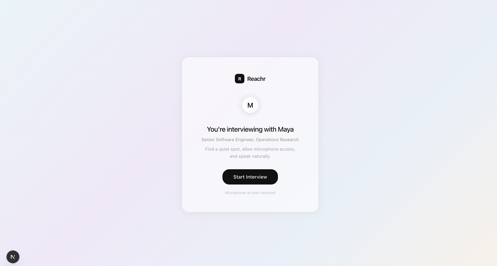

# Reachr — AI Voice Recruiting Agent

> AI that screens so you don't have to



Reachr is an AI-powered recruiting platform where **Maya**, an AI voice agent, conducts live candidate screening interviews, transcribes responses in real time, and generates structured scorecards — automatically.

No scheduling. No phone tag. No manual screening.

---

## How It Works

1. Recruiter creates a job with required skills and description
2. Reachr generates a shareable candidate interview link
3. Candidate opens the link, clicks Start Interview, and speaks naturally
4. Maya conducts a structured voice interview — job-aware, contextual, conversational
5. Scorecard is generated automatically across 5 dimensions
6. Recruiter reviews candidates ranked by score in the dashboard

---

## Features

- 🎙️ **Live voice interviews** via real-time WebSocket audio pipeline
- 🤖 **Maya AI interviewer** powered by Groq Llama 3.3 70B
- 📝 **Real-time transcription** via Groq Whisper
- 💼 **Job-aware prompting** — Maya adapts every question to the specific role and required skills
- 🧠 **Conversation memory** — full transcript passed on every turn for contextual follow-ups
- 📊 **5-dimension scorecard** — communication, relevance, experience, availability, culture fit
- 📋 **Recruiter dashboard** — interview tracking, scorecards, job management
- 🔗 **Shareable candidate links** — tied to real candidate names

---

## Tech Stack

| Layer | Tech |
|-------|------|
| Frontend | Next.js 15, TypeScript, Tailwind CSS |
| Backend | FastAPI, Python |
| AI — STT | Groq Whisper (whisper-large-v3) |
| AI — LLM | Groq Llama 3.3 70B |
| Database | Supabase (PostgreSQL + RLS) |
| Realtime | WebSockets (PCM audio streaming) |
| Deploy | Vercel (frontend) + Railway (backend) |

---

## Architecture

```
Browser mic
    ↓ PCM audio chunks (16kHz Int16LE)
WebSocket → FastAPI
    ↓ pcm_to_wav()
Groq Whisper STT → transcript text
    ↓ + job context + conversation history
Groq Llama 3.3 70B → Maya response
    ↓
WebSocket → Browser
    ↓
Web Speech API (speechSynthesis) → candidate hears Maya
```

---

## Getting Started

### Prerequisites
- Python 3.9+
- Node.js 18+
- Supabase account (free)
- Groq API key (free at console.groq.com)

### Backend
```bash
cd backend
python -m venv .venv
source .venv/bin/activate
pip install -r requirements.txt
cp .env.example .env
# Add your keys to .env
uvicorn main:app --reload
```

### Frontend
```bash
cd frontend
npm install
cp .env.example .env.local
# Add your Supabase keys to .env.local
npm run dev
```

### Environment Variables

**Backend `.env`**
```
SUPABASE_URL=
SUPABASE_KEY=
GROQ_API_KEY=
```

**Frontend `.env.local`**
```
NEXT_PUBLIC_SUPABASE_URL=
NEXT_PUBLIC_SUPABASE_ANON_KEY=
NEXT_PUBLIC_API_URL=http://localhost:8000
```

### Database
Run `supabase/migrations/001_initial_schema.sql` in your Supabase SQL editor to set up all tables.

---

## Project Structure

```
Reachr/
├── backend/
│   ├── main.py                  # FastAPI app entry point
│   ├── routers/
│   │   └── interview.py         # All interview, job, scoring endpoints
│   ├── db/
│   │   └── schema.py            # Pydantic models
│   └── requirements.txt
├── frontend/
│   ├── app/
│   │   ├── dashboard/           # Recruiter dashboard
│   │   │   ├── page.tsx         # Overview + metrics
│   │   │   ├── interviews/      # Interview list + detail
│   │   │   └── jobs/            # Job management
│   │   └── interview/
│   │       └── [token]/         # Candidate interview page
│   └── lib/
│       └── supabase.ts
└── supabase/
    └── migrations/
        └── 001_initial_schema.sql
```

---

## Built By

**Shrivatsasingh Rathore**  
MS Data Science, Arizona State University

[Portfolio](https://shriv-portfolio.vercel.app) · [LinkedIn](https://linkedin.com/in/shrivatsasingh-rathore) · [GitHub](https://github.com/SThor07)

---

## License

MIT — build on it, learn from it, ship your own version.
